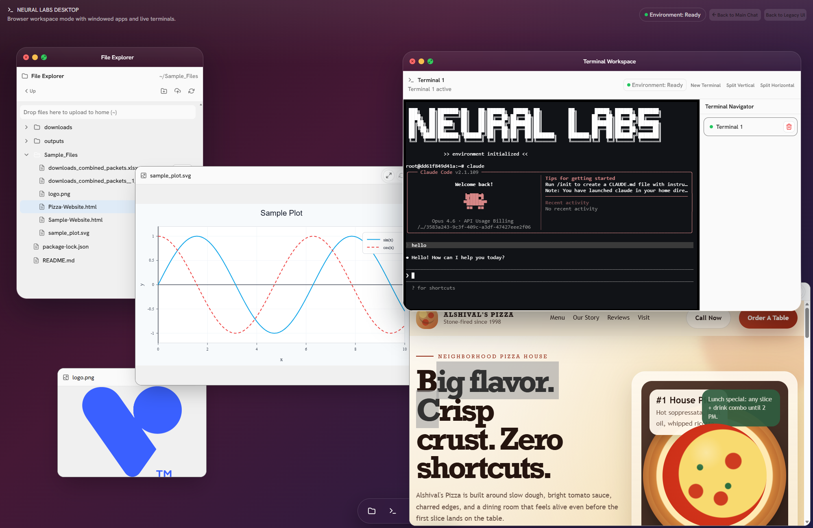
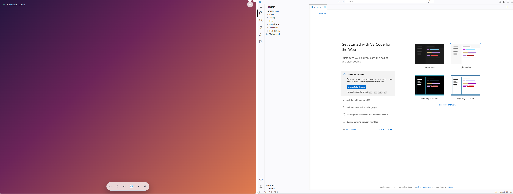

# Neural Labs

Neural Labs is a full browser workspace for teams that need more than a chat box. It gives each user a persistent Docker-backed environment with files, terminals, AI chat, previews, settings, invite-only access, and VS Code in the browser.

It feels like a lightweight cloud desktop: open files, run commands, inspect generated artifacts, chat with `Neura`, and jump into VS Code without leaving the browser.



[Watch the Neural Labs demo](https://youtu.be/PnmC09Jj6jk)

## Why It Exists

Neural Labs is built for AI-assisted work where the browser should be the whole operating surface, not just the chat UI.

- **A real workspace per user**: every user gets a dedicated Docker volume and managed workspace container.
- **Tools where the files live**: terminal, file explorer, previews, editor, and VS Code all point at the same persistent home directory.
- **Invite-only access**: seed the first admin, invite users, and let each person return to their own workspace.
- **Provider-ready AI chat**: bootstrap OpenAI-compatible and Anthropic-compatible providers from `.env`, then manage them in Settings.
- **Browser-native VS Code**: launch VS Code from the dock in a new tab, backed by the same workspace container.

## VS Code In The Browser

Click the VS Code icon in the dock and Neural Labs starts `code-server` inside that user's workspace container. The browser opens `/vscode/` in a new tab through the Neural Labs authenticated proxy.

That means the Neural Labs terminal, file manager, and VS Code all see the same files, SSH config, Git config, and home directory.



## Quick Start

If you are just trying to get the app running, you do not need to understand the internal architecture first.

### What You Need

For the standard setup, install:

- Docker Engine or Docker Desktop
- Docker Compose support (`docker compose`)

That is the intended way to run this repo. Most users should not need to run the Next.js app directly.

### 1. Configure the Environment

From the repository root:

```bash
cp .env.example .env
```

Open `.env` and set at least these values:

```bash
AUTH_SECRET=change-this-to-a-long-random-value
NEURAL_LABS_INITIAL_ADMIN_EMAIL=admin@alshival.ai
NEURAL_LABS_INITIAL_ADMIN_PASSWORD=change-me-admin-password
OPENAI_DEFAULT_API_KEY=your_api_key_here
```

Recommended first-pass guidance:

- set `AUTH_SECRET` to a long random string before sharing the app with anyone
- set the initial admin email and password to credentials you will actually use
- add at least one provider API key if you want `Neura` to work immediately
- leave the rest of the defaults alone unless you already know you need to change them

### 2. Start the App

From the repository root:

```bash
./start.sh
```

If the script is not executable on your machine yet:

```bash
chmod +x start.sh
./start.sh
```

The helper script starts the Docker Compose stack defined in `compose.yml` and builds the image by default.

### 3. Open the App

By default, open:

```text
http://localhost:3001
```

If you changed `PORT` in `.env`, use that port instead.

### 4. Sign In

On first boot with an empty auth database:

- Neural Labs creates the first admin account from `NEURAL_LABS_INITIAL_ADMIN_EMAIL` and `NEURAL_LABS_INITIAL_ADMIN_PASSWORD`
- the sign-in screen is available at `/login`
- the root route `/` redirects to `/login` or `/desktop` depending on session state

After signing in, you land in the desktop workspace.

### 5. Invite Other Users

Invite management is inside the desktop UI for admins:

1. Sign in as an admin.
2. Open the `Settings` app on the desktop.
3. Open the `Admin` section.
4. Create an invite link for another user.
5. Share that link with them.

Invited users accept their link, set their password, and then use the normal sign-in page going forward.

## First 5 Minutes

If you want the shortest possible walkthrough:

1. Run `cp .env.example .env`.
2. Fill in `AUTH_SECRET`, the initial admin credentials, and at least one provider API key.
3. Run `./start.sh`.
4. Open `http://localhost:3001`.
5. Sign in with the seeded admin account.
6. Open `Settings` to test providers, set the default provider for `Neura`, and create invite links.
7. Click the VS Code icon in the dock to open the same workspace in browser VS Code.

## Common Startup Commands

The helper script is the normal entrypoint.

Basic start:

```bash
./start.sh
```

Restart the compose stack first:

```bash
./start.sh --compose-restart
```

Start in the background and follow logs:

```bash
./start.sh --detach --logs
```

Use a different compose file:

```bash
./start.sh -f compose.yml
```

Show help:

```bash
./start.sh --help
```

Useful options:

- `--compose-restart` runs `docker compose down --remove-orphans` first
- `--detach` or `-d` starts the stack in the background
- `--logs` follows service logs after startup
- `--no-build` skips the image rebuild
- `--service <name>` chooses which service to follow when using `--logs`
- `--` passes extra arguments through to `docker compose up`

## Troubleshooting

### The app does not start

Check:

- Docker is running
- `docker compose` is available
- `.env` exists in the repository root
- the configured `PORT` is not already in use

### I can reach the login screen but `Neura` does not work

Usually this means provider configuration is incomplete. Check either:

- the provider bootstrap values in `.env`
- or the configured providers in the desktop `Settings` -> `Providers` panel

### I cannot sign in

Check:

- you are using the exact admin email and password from `.env`
- the auth database was empty on first boot when you expected the admin account to be seeded
- you are using an invite-created account if this is not the first admin login

### I changed `.env` but nothing seems different

If the app is already running in Docker, restart it:

```bash
./start.sh --compose-restart
```

## Technical Reference

Everything below is for operators, contributors, and power users.

## Repository Layout

At a high level:

- `start.sh` is the beginner-friendly startup wrapper
- `compose.yml` defines the default container stack
- `Dockerfile` builds the production image used by Compose
- `neural-labs/` contains the actual Next.js application
- `.env` at the repo root is the canonical runtime configuration file

Typical users should stay at the repo root and use `./start.sh`.

## Runtime Model

Neural Labs is a Next.js application with a custom Node server entrypoint at `neural-labs/server.js`.

Important runtime behaviors:

- the app serves HTTP through the custom server
- terminal streaming is handled over a websocket endpoint
- authentication is persistent
- each user is mapped to a dedicated Docker-backed workspace

In the current implementation, the workspace backend is docker-backed in practice. Each user gets:

- a dedicated Docker volume for workspace data
- a dedicated Docker container for terminal and file operations
- persistent workspace state stored under `.neural-labs/` inside that user workspace

## Environment Configuration

The repository-root `.env` file is the canonical config source.

Key values:

### Server and Auth

```bash
PORT=3001
AUTH_SECRET=change-me-before-production
AUTH_BASE_URL=
AUTH_DB_PATH=/app/data/auth/auth.db
AUTH_COOKIE_SECURE=false
NEURAL_LABS_INITIAL_ADMIN_EMAIL=admin@alshival.ai
NEURAL_LABS_INITIAL_ADMIN_PASSWORD=change-me-admin-password
```

Notes:

- `PORT` controls the port used by the app and Docker port binding
- `AUTH_SECRET` should be stable and secret
- `AUTH_BASE_URL` is useful when invite links must point to an external hostname
- `AUTH_DB_PATH` points to the SQLite auth database
- `AUTH_COOKIE_SECURE` must stay `false` on plain HTTP local setups and should only be `true` behind HTTPS
- the initial admin credentials are used to seed the first admin account when the auth DB is empty

### Appearance Defaults

```bash
VITE_PUBLIC_APP_NAME=Neural Labs
NEURAL_LABS_THEME=system
NEURAL_LABS_BACKGROUND_ID=sunrise-grid
```

Supported built-in backgrounds include:

- `aurora`
- `graphite`
- `sunrise-grid`
- `ocean-night`

### Provider Bootstrap

Provider values in `.env` are used to seed the app with ready-to-use model connections.

OpenAI-compatible defaults:

```bash
OPENAI_DEFAULT_API_KEY=
OPENAI_DEFAULT_MODEL=gpt-5-mini
OPENAI_DEFAULT_NAME=OpenAI
OPENAI_DEFAULT_BASE_URL=https://api.openai.com/v1
```

Anthropic defaults:

```bash
ANTHROPIC_DEFAULT_API_KEY=
ANTHROPIC_DEFAULT_MODEL=claude-sonnet-4-20250514
ANTHROPIC_DEFAULT_NAME=Anthropic
ANTHROPIC_DEFAULT_BASE_URL=https://api.anthropic.com/v1
```

Default provider selection:

```bash
NEURAL_LABS_DEFAULT_PROVIDER=openai
```

Operationally:

- if you want `Neura` working immediately, set at least one provider API key before first start
- admins can later inspect and update providers from the desktop `Settings` -> `Providers` section

### Workspace Runtime

```bash
NEURAL_LABS_WORKSPACE_BACKEND=docker
NEURAL_LABS_WORKSPACE_IMAGE=neural-labs-workspace:latest
NEURAL_LABS_WORKSPACE_NETWORK=neural-labs-workspaces
NEURAL_LABS_WORKSPACE_SHELL=bash
NEURAL_LABS_CONTAINER_IDLE_TIMEOUT_MS=3600000
NEURAL_LABS_CONTAINER_IDLE_SWEEP_INTERVAL_MS=300000
NEURAL_LABS_VSCODE_ENABLED=true
NEURAL_LABS_VSCODE_PORT=13337
```

Related implementation details:

- per-user workspace containers are created from `NEURAL_LABS_WORKSPACE_IMAGE`
- the default workspace image is built from `workspace.Dockerfile` and includes `code-server`
- the VS Code dock icon opens `/vscode/`, which is authenticated by Neural Labs and proxied to `code-server` inside the current user's workspace container
- the current workspace path inside those containers is configured separately by the app runtime
- the container and volume naming is derived from the user id with Neural Labs prefixes

## Docker Compose Behavior

The default `compose.yml`:

- builds the app image from the repository root
- connects the app to the shared workspace Docker network
- loads environment variables from `.env`
- binds `${PORT:-3001}` on the host
- mounts `.env` read-only into the container
- mounts an `auth-data` Docker volume for the SQLite auth database
- mounts `/var/run/docker.sock` so the app can create per-user Docker containers
- mounts `/var/lib/docker/volumes` so workspace volumes are accessible to the app runtime

This design is what enables persistent per-user workspaces managed from inside the app container.

### Direct Compose Commands

If you do not want to use the helper script:

Start:

```bash
docker compose up --build
```

Stop:

```bash
docker compose down
```

Restart from a clean running state:

```bash
docker compose down --remove-orphans
docker compose up --build
```

## Docker Image

Build manually from the repository root:

```bash
docker build -t neural-labs .
```

Run manually:

```bash
docker volume create auth-data
docker run --rm -p ${PORT:-3001}:${PORT:-3001} --env-file .env -v /var/run/docker.sock:/var/run/docker.sock -v /var/lib/docker/volumes:/var/lib/docker/volumes -v auth-data:/app/data/auth neural-labs
```

The image builds the Next.js app from `neural-labs/` and starts it through `npm run start`.
For normal operation, Docker Compose remains the recommended path because it wires these mounts and persistence settings for you.

## Local App Development

If you want to work directly on the app instead of using the helper script:

```bash
cd neural-labs
npm install
npm run dev
```

Available scripts:

- `npm run dev` starts the custom server in development mode
- `npm run build` builds the Next.js app
- `npm run start` starts the production server
- `npm run typecheck` runs TypeScript without emitting files

When using local app scripts, remember the app still expects the repo-root `.env` file to exist.

## Data and Persistence

There are two main persistence layers:

- auth data in SQLite at `AUTH_DB_PATH`
- per-user workspace data in Docker volumes

With the default docker-backed setup:

- each user gets their own volume
- each user gets their own managed workspace container
- workspace files and Neural Labs state persist across app restarts
- auth data, sessions, and invites persist in the mounted auth database volume

## User Flow for Operators

The actual access flow is:

1. Seed the first admin account through `.env`.
2. Start the app.
3. Sign in through `/login`.
4. Open the desktop workspace.
5. Use `Settings` -> `Admin` to create invite links.
6. Invited users accept the link and set their password.
7. Returning users sign in normally and return to the same persistent workspace.

## Verification

From `neural-labs/`:

```bash
npm run typecheck
npm run build
```

These are the main checks to run when validating application changes.
