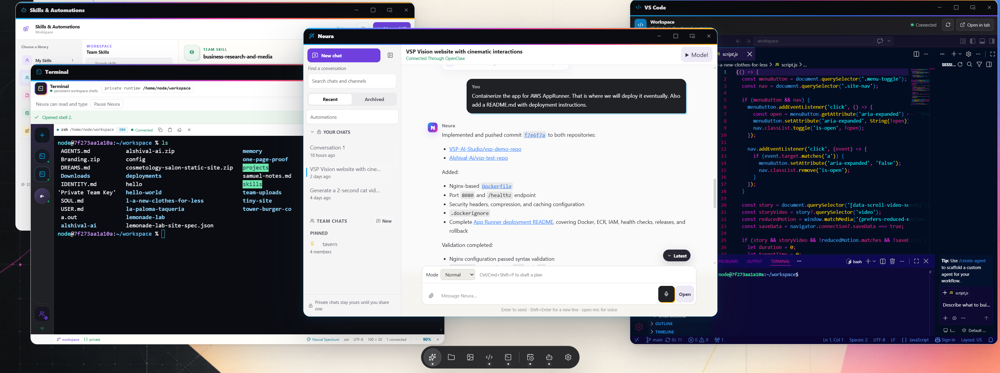
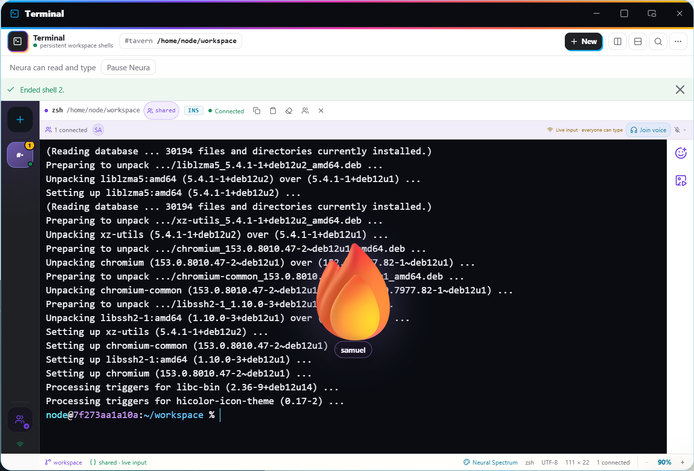
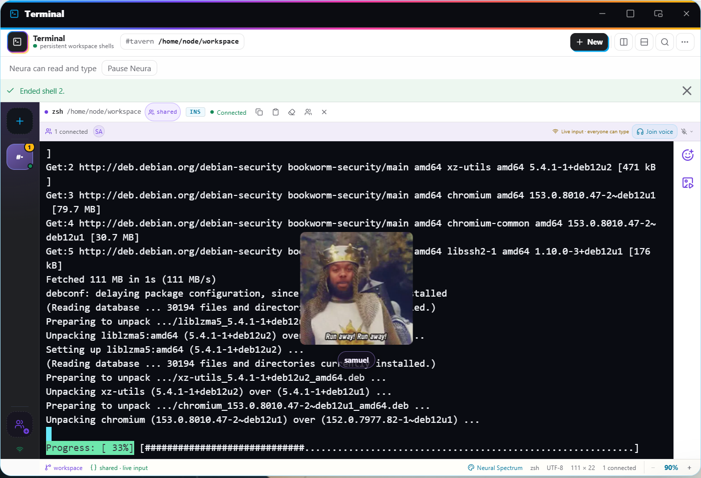

<p align="center">
  <a href="https://alshival.ai">
    
  </a>
</p>

<h1 align="center">Neural Labs by Alshival.Ai</h1>

<p align="center">
  <strong>AI · Data · Cloud</strong><br>
  Practical systems. Open engineering. Shared context.
</p>

<p align="center">
  <a href="https://alshival.ai">Website</a> •
  <a href="https://github.com/enterprises/alshival-ai">Enterprise</a> •
  <a href="https://github.com/orgs/Alshival-Ai/repositories">Repositories</a> •
  <a href="https://neural-labs.ai">Neural Labs</a> •
  <a href="mailto:support@alshival.ai">Contact</a>
</p>

Neural Labs is an open-source, self-hosted AI workspace for teams. It brings
Neura, project files, a terminal, VS Code, reusable skills, and scheduled
automations into one browser desktop, backed by a persistent shared workspace.

Built on OpenClaw, Neural Labs gives trusted teammates a place to build with AI,
work on the same projects, and turn useful workflows into skills the whole team
can reuse. Run it on your own infrastructure, connect your AI account, and
invite your team.

**[Set up your instance](https://github.com/Alshival-Ai/neural-labs/wiki)** ·
[Browse the guides](wiki/README.md) · [Changelog](CHANGELOG.md)



*One desktop for conversations, code, shared tools, and repeatable work.*

## Why a team would use Neural Labs

- **Work from the same project files.** Files, VS Code, terminals, and AI tools
  use the same workspace. A teammate can pick up the files another person or
  Neura has been working on.
- **Build and troubleshoot together.** Join a team terminal to see the same
  command output and type into the same shell. Add voice when a conversation
  would help with a debugging session, pairing task, or release.
- **Share the team's know-how.** Package research methods, coding conventions,
  or delivery checklists as reusable skills. Collaborate on drafts, test them
  with Neura, and publish them for the team.
- **Make recurring work easier to run.** Turn a tested workflow into an
  automation with a schedule and run history. Jobs can keep running while your
  browser is closed, as long as the workspace stays online.
- **Manage a workspace you host.** Approve members, configure integrations,
  and manage updates and backups on infrastructure your team controls.

For example, a team can plan a feature with Neura, edit it in VS Code, pair on
tests in a shared terminal, and save the repeatable review steps as a team skill.

## What's in the workspace

| App | What your team can do |
|---|---|
| [Neura](wiki/neura.md) | Work with an AI assistant in personal conversations and bring Neura into team chats. |
| [Files](wiki/files.md) | Browse, upload, preview, and organize shared project files. |
| [VS Code](wiki/vscode.md) | Edit projects in the browser using the workspace's files and developer tools. |
| [Terminal](wiki/terminal.md) | Start personal shells or join team sessions with shared input, voice, and reactions. |
| [Skills](wiki/skills.md) | Create, test, and publish reusable personal and team workflows. |
| [Automations](wiki/automations.md) | Schedule repeatable work and inspect its status and run history. |
| [Settings](wiki/desktop-settings.md) | Manage your account and appearance; administrators also manage users and workspace integrations. |

## A terminal you can share

Team terminals connect teammates to the same live shell. Everyone can type,
see who is connected, join voice, and send emoji or GIF reactions without
leaving the work.

| Emoji reactions | GIF reactions |
|---|---|
|  |  |

Personal terminals are visible only to their creator. Team terminals let
teammates share a session; leaving one keeps its shell running, while the
creator or an administrator can end it for everyone. See the
[Terminal guide](wiki/terminal.md) for session behavior and collaboration controls.

## Get started

Your agent can deploy your own instance using [AGENTS.md](AGENTS.md). Give it
the intended host or hosting account, final hostname, and administrator email;
it should inspect the target and guide you through the first working session.
See [Deploy with your agent](wiki/agent-onboarding.md) for a copyable prompt and
current platform support.

The [deployment guide](wiki/container-deployment.md) walks through host prerequisites, configuration,
HTTPS, administrator signup, connecting ChatGPT or a personal OpenAI API key, and a first Neura
request. Deployment uses Docker Compose behind host Nginx.

From a checkout on a prepared host:

```bash
bin/neural-labs init
# Edit .env: hostname, HTTPS origin, administrator email, and TURN addresses.
bin/neural-labs up
```

Continue with the [HTTPS and account setup steps](wiki/container-deployment.md).
The commands above do not install Nginx or configure DNS and certificates.
Microsoft sign-in and provider integrations are optional.

If your instance is already running, follow [Your first workspace session](wiki/shared-workspace.md).
Administrators can use [Settings](wiki/desktop-settings.md) for user approval
and integrations, the [deployment guide](wiki/container-deployment.md#updating)
for updates, and [Backup and restore](wiki/backup-restore.md) for recovery.

Approved users share one container and filesystem. Personal chat and account
controls provide application authorization, not operating-system isolation from
other trusted developers. Read [the shared-workspace architecture](wiki/adr/0003-shared-developer-workspace.md)
before inviting users. Never commit credentials, certificates, deployment
secrets, or generated state.

## Repository layout

| Directory | Purpose |
|---|---|
| `web/` | Public landing page |
| `console/` | Login, signup, and account-approval interface |
| `control-plane/` | Accounts, sessions, authorization, and administration APIs |
| `workspace/` | Desktop and pinned OpenClaw/Codex developer runtime |
| `mcp/` | Workspace-local provider tools and retained future public MCP implementation |
| `deploy/` | Compose services and host Nginx configuration |
| `wiki/` | Documentation sources exported to the GitHub wiki |

Use `bin/neural-labs help` for lifecycle commands. Run `make validate` before
committing. Current release: **v0.3.2**; see [release record](wiki/releases/v0.3.2.md).
See the [project tracker](tracker.md) for planning and the
[documentation index](wiki/README.md#architecture-decisions) for architecture records.
